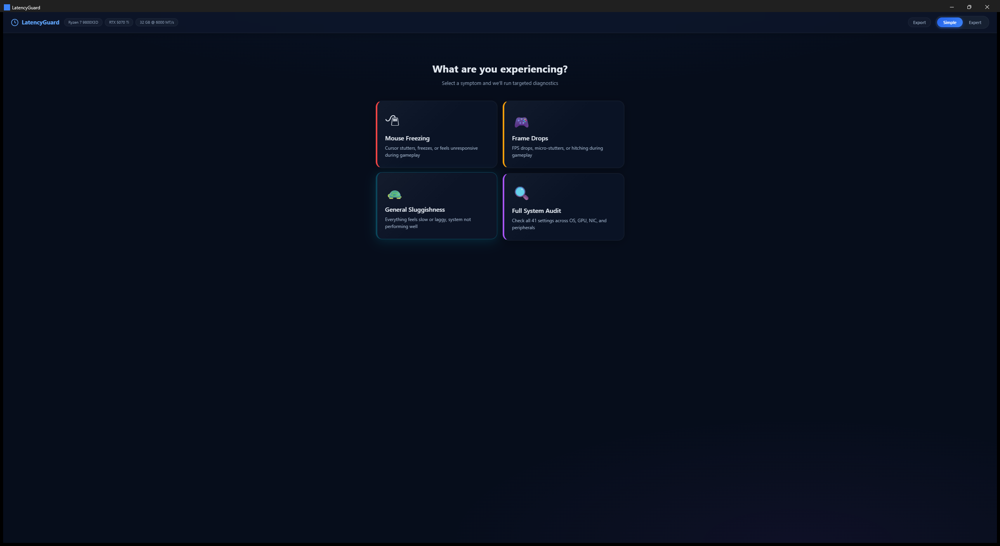
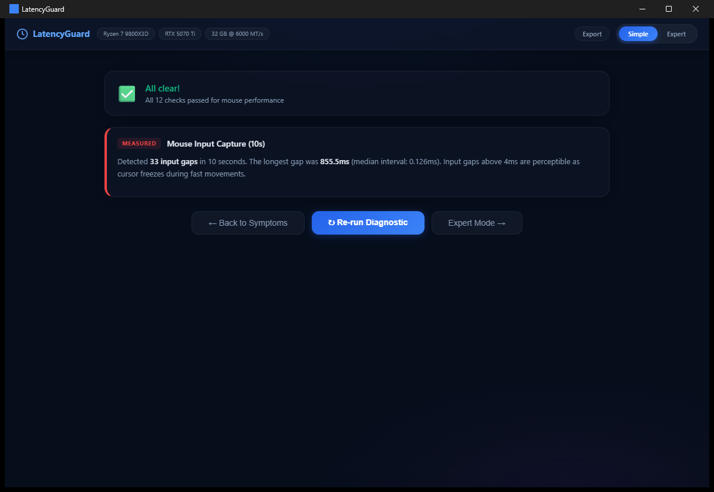
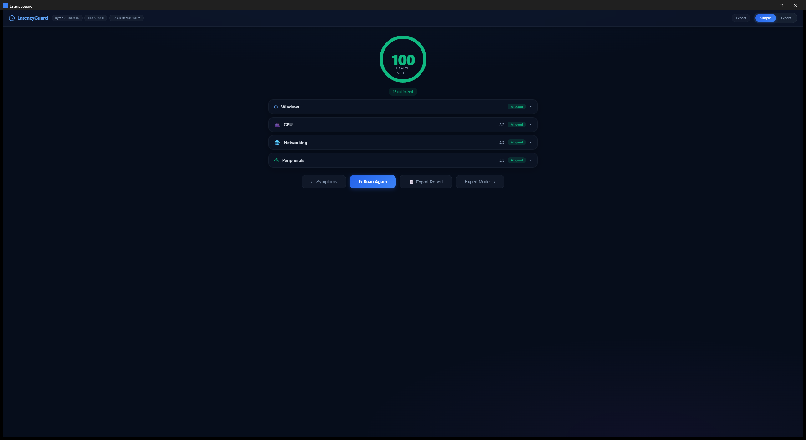
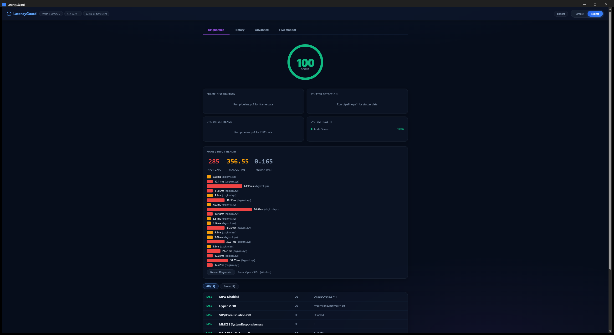

# LatencyGuard

A desktop diagnostic tool that finds and fixes the hidden Windows settings causing gaming latency — built with Rust, PowerShell, and kernel-level ETW tracing.

[](LICENSE)




## What It Does

Most "optimization guides" hand you a checklist of registry tweaks and hope for the best. LatencyGuard takes a different approach: **it asks what's wrong, then figures out why.**

- **Symptom-first diagnostics** — opens with "What are you experiencing?" instead of a dashboard of numbers. Pick your symptom (mouse freezing, frame drops, sluggishness) and the app runs only the relevant checks
- **41 automated checks** across OS, GPU, NIC, network, memory, and peripherals — each with a plain-English explanation of what it found and why it matters
- **Kernel-level ETW tracing** — captures HID input events at microsecond precision to detect mouse input gaps, then blames the specific driver (nvlddmkm.sys, storport.sys) that caused each freeze
- **One-click fixes with proof** — applies registry changes and immediately re-checks to show you before/after verification. Every fix has a rollback command
- **22 controlled experiments** with before/after captures, following a scientific methodology documented in [docs/methodology.md](docs/methodology.md)

## Screenshots

### Symptom Picker
The landing page. Select your symptom and LatencyGuard runs a targeted subset of its 41 checks.


### Diagnostic Progress
Real-time step-by-step progress via Tauri event streaming. Each diagnostic chain shows a determinate progress bar with green checkmarks as steps complete. For "Mouse Freezing," the chain runs 5 steps: check polling rate, analyze GPU interrupts, measure DPC latency, run 10-second ETW input capture, and analyze results.

### Findings
Plain-English results. Every finding explains what's happening, why it matters, and how to fix it. Mouse diagnostics show gap count, max gap duration, and which driver was responsible.



### Dashboard
Health score with category breakdown. Expand any category to see individual checks with current values, recommended settings, and one-click "Apply" buttons.



### Expert Mode
Full diagnostic view: mouse input gap bars with driver blame attribution, system health metrics, and a filterable 41-check audit table. Tabs for History, Advanced raw data, and Live Monitor.



## Key Results

This system (Ryzen 7 9800X3D + RTX 5070 Ti) went from a baseline where **97.7% of all interrupt work was bottlenecked on CPU 0** to a balanced, optimized state:

| Metric | Before | After | Change |
|--------|--------|-------|--------|
| CPU 0 interrupt share | 97.7% | 0.9% | 99% reduction |
| Mouse input gaps | 103 gaps (703ms max) | 25 gaps (11ms max) | 92% reduction |
| Total DPC latency | 0.40% | 0.54% | Redistributed across cores |
| Top DPC driver | nvlddmkm.sys (561us) | storvsp.sys (8us) | GPU DPC eliminated |
| Defender hard pagefaults | 149 in 2min | <10 | 93% reduction |
| Audit score | — | 98% (39 pass, 1 warn, 1 skip) | Fully optimized |

## How It Works

### Architecture

```
User selects symptom
  |
  v
Tauri Rust Backend
  |-- emits real-time progress events to frontend
  |-- spawns PowerShell: audit-checks.ps1 -Symptom MouseFreezing
  |-- spawns PowerShell: diagnose-mouse.ps1 (ETW capture)
  |-- reads audit JSON + mouse diagnostic JSON
  |-- attaches narrative templates to each finding
  |-- returns aggregated findings
  |
  v
JS Frontend renders findings cards
  |-- plain-English what/why/fix for each issue
  |-- "Apply Fix" button -> Rust -> PowerShell -> re-check -> proof card
```

### The Diagnostic Chain

When you click a symptom, LatencyGuard runs a targeted pipeline:

1. **System audit** — checks a filtered subset of 41 settings relevant to your symptom (registry keys, WMI queries, driver configs)
2. **Mouse capture** (Mouse Freezing only) — 10-second ETW trace via Windows Performance Recorder, capturing raw HID input events at the kernel level
3. **DPC/ISR analysis** — measures Deferred Procedure Call latency per driver using xperf ETW traces
4. **Gap detection** — calculates inter-event timing on mouse input, identifies gaps >4ms, and correlates each gap with the driver that had the highest DPC time during that window
5. **Results aggregation** — attaches plain-English narrative templates and severity ratings

### Symptom-to-Check Mapping

| Symptom | Checks Run | Key Focus |
|---------|-----------|-----------|
| Mouse Freezing | 13 checks | Polling rate, USB controller, GPU MSI, DPC health, interrupt affinity, VBS/Hyper-V |
| Frame Drops | 14 checks | HAGS, GPU MSI/ReBAR, power plan, MMCSS, platform clock, RAM speed |
| General Sluggishness | 17 checks | Power plan, Defender exclusions, telemetry, background services, TCP tuning |
| Full System Audit | All 41 | Everything across all 6 categories |

## Diagnostic Tools & Techniques

| Tool | What It Does | How LatencyGuard Uses It |
|------|-------------|------------------------|
| **ETW / WPR** | Kernel-level event tracing | Captures HID input events to detect mouse gaps with microsecond precision |
| **xperf** | DPC/ISR latency measurement | Per-driver breakdown: which driver is consuming the most time in deferred contexts |
| **NVIDIA Nsight Systems** | GPU timeline profiling | 30-second GPU trace for nvlddmkm.sys DPC analysis |
| **WMI / Registry** | System configuration queries | Reads 41 settings across power plans, driver configs, interrupt affinity, and more |
| **pktmon** | Network packet capture | Bufferbloat detection via latency-under-load measurement |
| **ProcMon** | Process I/O monitoring | Tracks Defender scan I/O during gameplay |
| **GPUView** | GPU queue visualization | Frame presentation timing and GPU work queue depth |

## The 41 Checks

<details>
<summary>Click to expand full check list</summary>

| # | Check | Category | Severity | What It Detects |
|---|-------|----------|----------|----------------|
| 1 | MPO Disabled | OS | Medium | Multi-Plane Overlay causing cursor flicker |
| 2 | Hyper-V Off | OS | High | Hypervisor adding latency to hardware access |
| 3 | VBS/Core Isolation Off | OS | High | Virtualization-Based Security overhead |
| 4 | MMCSS SystemResponsiveness | OS | Medium | Background task CPU reservation during gaming |
| 5 | MMCSS NetworkThrottling | OS | Medium | Network packet throttling during multimedia |
| 6 | MMCSS Games Priority | OS | Low | Game thread scheduling priority |
| 7 | Power Plan | OS | High | CPU frequency throttling |
| 8 | Win32PrioritySeparation | OS | Medium | Foreground process scheduling |
| 9 | GameInput Duplicates | OS | Low | Duplicate input device registrations |
| 10 | KB5077181 Stutter Bug | OS | High | Known Windows update causing stutters |
| 11 | Defender Gaming Exclusion | OS | Medium | Defender scanning game folders |
| 12 | Defender Shader Exclusion | OS | Medium | Defender scanning shader cache |
| 13 | LwtNetLog Disabled | OS | Medium | ETW autologger consuming 5-15% CPU |
| 14 | DiagTrack Disabled | OS | Low | Telemetry service background I/O |
| 15 | Platform Clock (HPET) | OS | Medium | Timer source adding ~1ms overhead |
| 16 | Anti-Cheat Drivers | OS | Low | Kernel-level anti-cheat DPC impact |
| 17 | GPU MSI Mode | GPU | Critical | Line-based interrupt sharing vs dedicated MSI |
| 18 | GPU Interrupt Affinity | GPU | High | GPU interrupts landing on game thread core |
| 19 | HAGS Enabled | GPU | High | Hardware GPU Scheduling (RTX 40/50) |
| 20 | NVIDIA DPC Health | GPU | Critical | nvlddmkm.sys DPC spikes >500us |
| 21 | NVIDIA Power Max Perf | GPU | Medium | GPU clock downshift between frames |
| 22 | GPU ReBAR | GPU | Medium | CPU-GPU memory access bandwidth |
| 23 | NIC Driver Line | NIC | Medium | Intel I226 driver version |
| 24 | NIC Speed/Duplex | NIC | Low | Link speed negotiation |
| 25 | NIC EEE | NIC | Medium | Energy Efficient Ethernet adding latency |
| 26 | NIC Interrupt Moderation | NIC | Medium | Interrupt batching adding packet delay |
| 27 | Nagle Disabled | NIC | Medium | TCP packet batching (up to 200ms delay) |
| 28 | NIC Interrupt Affinity | NIC | Medium | NIC interrupts competing with game threads |
| 29 | Mouse Polling Rate | Peripheral | High | Mouse report rate (125Hz vs 1000Hz) |
| 30 | Mouse USB Controller | Peripheral | Medium | USB port sharing/contention |
| 31 | Overlay Processes | Peripheral | Low | Render pipeline hooks from overlays |
| 32 | Capture Card Present | Peripheral | Low | Capture card interrupt overhead |
| 33 | RAM Speed vs Rated | Memory | Medium | JEDEC defaults vs XMP (10-15% slower) |
| 34 | NIC Flow Control | Network | Low | Ethernet flow control adding latency |
| 35 | NIC IPv6 Disabled | Network | Low | IPv6 overhead on gaming connections |
| 36 | Network Latency Probe | Network | Medium | Multi-server ping p50/p95/p99 |
| 37 | TCP Auto-Tuning | Network | Low | Window scaling buffer bloat |
| 38 | TCP InitialRTO | Network | Low | Initial retransmission timeout |
| 39 | TCP RSC | Network | Medium | Receive segment coalescing latency |
| 40 | TCP Timestamps | Network | Low | TCP timestamp option overhead |
| 41 | Bufferbloat | Network | Medium | Latency under load vs idle |

</details>

## Tech Stack

| Layer | Technology | Why |
|-------|-----------|-----|
| Desktop Runtime | **Tauri v2** (Rust) | Native performance, 5MB binary, system-level access via PowerShell child processes |
| Backend | **Rust** | Async command handlers, Tauri event streaming for real-time progress, serde JSON |
| Diagnostic Scripts | **PowerShell 5.1** | Direct access to WMI, Windows Registry, ETW via WPR, admin-level system queries |
| Frontend | **Vanilla JS** | Zero framework overhead, string-template rendering, Tauri IPC via `invoke()` |
| Styling | **CSS** | Glass morphism (`backdrop-filter: blur`), CSS custom properties, semantic color system |
| Kernel Tracing | **ETW / WPR / xperf** | Hardware-level event capture (HID, DPC, ISR) with microsecond precision |
| GPU Profiling | **NVIDIA Nsight Systems** | GPU timeline capture, driver DPC measurement |
| Testing | **PowerShell + Cargo** | 32 automated tests: PS syntax validation, XML schema checks, Rust compilation |

## Build & Run

### Prerequisites

- Windows 11 (Build 26100+)
- [Rust toolchain](https://rustup.rs/) (for building the Tauri app)
- Node.js 18+ (for `@tauri-apps/api`)
- PowerShell 5.1 (built into Windows)
- **Administrator access** required for ETW traces and registry reads

### Quick Start

```bash
# Clone the repo
git clone https://github.com/Lcxiv/windows-latency-optimizer.git
cd windows-latency-optimizer

# Build and run the Tauri app
cd latencyguard/src-tauri
cargo run
```

The app will detect your system info, load any cached audit data, and present the symptom picker.

### Running Scripts Standalone

You don't need the Tauri app to use the diagnostic scripts:

```powershell
# Run as Administrator

# Full system audit (41 checks, generates JSON + HTML report)
.\scripts\audit.ps1 -Mode Deep

# Targeted audit for a specific symptom
.\scripts\audit.ps1 -Mode Deep -Symptom MouseFreezing

# Mouse stutter diagnostic (10-second ETW capture)
.\scripts\diagnose-mouse.ps1 -DurationSec 10

# Full experiment pipeline (WPR trace + perf counters + GPU + network)
.\scripts\pipeline.ps1 -Label "MY_EXPERIMENT" -DurationSec 120

# Rollback a registry change
.\scripts\rollback.ps1 -BackupFile .\captures\backup_pre_exp05.txt -WhatIf
```

## Project Structure

```
windows-latency-optimizer/
├── latencyguard/                  # Tauri v2 desktop app
│   ├── src/                       # Frontend (JS/CSS/HTML)
│   │   ├── app.js                 # Symptom picker, diagnostic chain, dashboard
│   │   ├── app.css                # Glass morphism theme, responsive layout
│   │   ├── views/diagnostics.js   # Findings renderer, narrative templates, proof cards
│   │   ├── views/history.js       # Experiment history & comparison
│   │   └── views/advanced.js      # Raw data tables (ETW, per-CPU, DPC drivers)
│   └── src-tauri/                 # Rust backend
│       └── src/commands.rs        # 12 Tauri commands (audit, diagnostic chain, fixes)
├── scripts/                       # 30 PowerShell scripts
│   ├── audit.ps1                  # System audit orchestrator
│   ├── audit-checks.ps1           # 41 check implementations
│   ├── diagnose-mouse.ps1         # Mouse stutter ETW capture
│   ├── pipeline.ps1               # Full experiment pipeline
│   ├── analyze-dpc-deep.ps1       # DPC/ISR per-driver analysis
│   ├── rollback.ps1               # Safe registry rollback
│   └── exp*.ps1                   # Individual experiment apply scripts
├── captures/                      # Experiment data & audit results
│   ├── audits/                    # JSON + HTML audit reports
│   └── experiments/               # Timestamped experiment folders
├── docs/
│   ├── methodology.md             # Scientific protocol & reproducibility guide
│   ├── findings.md                # Initial LatencyMon root cause analysis
│   ├── tools-glossary.md          # Reference for all diagnostic tools
│   └── screenshots/               # App screenshots for this README
├── dashboard/                     # Standalone web dashboard
└── tests/                         # PowerShell Pester tests
```

## System Under Test

| Component | Details |
|-----------|---------|
| CPU | AMD Ryzen 7 9800X3D (8C/16T, 3D V-Cache) |
| GPU | NVIDIA GeForce RTX 5070 Ti |
| RAM | 32 GB DDR5 @ 6000 MT/s |
| NIC | Intel I226-V 2.5 GbE |
| OS | Windows 11 Pro Build 26200 |
| Mouse | Razer Viper V3 Pro (Wireless) |

## Experiments

22 controlled experiments were run following the [scientific methodology](docs/methodology.md). Each captures baseline state, applies a change, re-measures, and stores results as JSON with rollback commands.

<details>
<summary>Click to expand experiment log</summary>

| # | Experiment | Key Change | Outcome |
|---|-----------|-----------|---------|
| 00 | Clean Baseline | — | Established reference metrics |
| 01 | MMCSS Priority | SystemResponsiveness: 20 -> 0 | More CPU time to game threads |
| 02 | Defender CPU Limit | ScanAvgCPULoadFactor: 50 -> 5 | Scan stalls reduced 93% |
| 03 | NVIDIA MSI Mode | MSISupported=1 | Eliminated legacy IRQ sharing |
| 04 | Interrupt Affinity | GPU/NIC -> CPUs 4-7 | Registry written (reboot required) |
| 05 | Post-Reboot Verify | — | **CPU 0 share: 97.7% -> 4.2%** |
| 06 | Input Affinity | KB/Mouse -> CPUs 2-3 | Input device isolation |
| 07 | C-State Tuning | BIOS C6 disable guide | Latency floor reduction |
| 08 | TCP Tuning | Nagle, RSC, auto-tuning | Network packet latency |
| 09 | HPET Disable | bcdedit /deletevalue useplatformclock | Timer overhead removed |
| 10 | Memory Compression | Disable-MMAgent -mc | Memory latency reduction |
| 11 | Stutter Fixes | MPO, FSO, GameBar | Presentation stutter fixes |
| 12 | NIC Retuning | Interrupt moderation + EEE | Network interrupt latency |
| 13 | FSO Mitigation | ForceFlipDisableOverlays | Fullscreen optimization |
| 15 | Latency Mitigations | Combined TCP + timer + priority | Compound improvement |
| 16 | DNS Optimization | Cloudflare DOH + cache | DNS lookup latency |
| 17 | Bufferbloat Test | Latency under load | Buffer queue measurement |
| 18 | Fortnite Gaming | Live gameplay capture | Real-world validation |
| 19 | Defender Exclusions | EasyAntiCheat + Epic exclusions | Scan I/O during gameplay |
| 20 | HAGS Toggle | HwSchMode=2 | RTX 5070 Ti needs HAGS enabled |
| 21 | MSI + Clocks | GPU MSI verify + clock stability | Combined GPU optimization |
| 22 | MSI + HAGS Fix | Post-reboot verification | **Final optimized state** |

</details>

## See Also

- [docs/methodology.md](docs/methodology.md) — Scientific protocol and reproducibility guide
- [docs/findings.md](docs/findings.md) — Initial LatencyMon root cause analysis
- [docs/implementation-plan.md](docs/implementation-plan.md) — Detailed fix plan with rollback commands
- [docs/tools-glossary.md](docs/tools-glossary.md) — Reference for all diagnostic tools
- [LATENCY-OPTIMIZATION-REPORT.md](LATENCY-OPTIMIZATION-REPORT.md) — Full 34KB optimization report

## License

[MIT](LICENSE) - Louis Condevaux ([@Lcxiv](https://github.com/Lcxiv))
